# Monocular Vision Localization Technology for UAVs  
Mingche Li  

## Abstract:  
To address the UAS4STEM 2024 competition challenge (where a drone must
identify a QR code on a 4'x4' target in the air and pick up/drop off an
item), a system was designed using monocular camera-based QR recognition
and vision-based localization technology. By using a pre-trained QR
recognition model, the QR code's pixel position on the image plane is
detected, and a series of coordinate transformations using camera
intrinsic parameters, and drone flight data (altitude, attitude angles,
GPS), we can ultimately calculate the QR code's GPS coordinates.

1.  ## System Structure:  
    ### The system mainly consists of a flight control system, a Raspberry
    Pi, and an OAK AI smart camera. The flight control system provides
    real-time altitude, attitude angles, and GPS information about the
    UAV. The OAK smart camera handles QR code recognition and provides
    the QR code’s pixel coordinates. The Raspberry Pi uses the data to
    calculate the QR code's location. See the schematic below:

2.  ## Localization Algorithm:  
    ### 2.1 **Coordinate System Definitions:**

- #### 2.1.1 Pixel Coordinate System:  
     A 2D coordinate system with the image's top-left corner as the
  origin.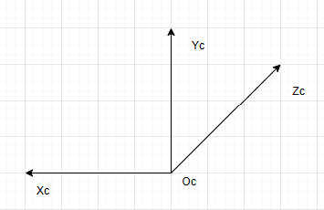

- #### 2.1.2 Camera Coordinate System:  
     A 3D coordinate system with the camera’s focal point as the origin,
  and the optical axis as the Z-axis, conforming to a right-handed
  coordinate system.
  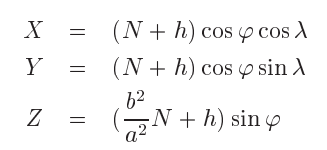

- #### 2.1.3 World Coordinate System:  
  This auxiliary system is located on the ground plane. The Y-axis is
  vertical, passing through the origin of the camera coordinate system,
  and the height between origins is the camera’s altitude h.

> 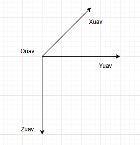

- #### 2.1.4 UAV Coordinate System:

> A 3D coordinate system with its origin at the center of the UAV
> (assuming the flight controller’s sensors are installed at the center
> of the UAV), conforms to a right-handed coordinate system.

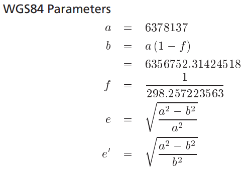

- #### 2.1.5 NED Coordinate System:

Origin is based on the center of the UAV. The axes are defined as
follows:

- The axis parallel to the north-south direction is the N-axis (with the
  north as the positive direction)

- The axis parallel to the east-west direction is the E-axis (with the
  east as the positive direction)

- The axis parallel to the north-south direction is the N-axis (with the
  north as the positive direction)

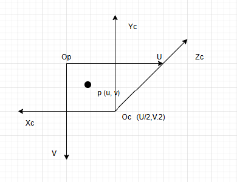

- #### 2.1.6 Earth-Centered, Earth-Fixed (ECEF) Coordinate System:

ECEF. Refer to Reference 10 for details.

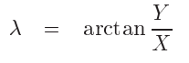

- #### 2.1.7 GPS Coordinate System:**

Based on the WGS84 reference system. Refer to Reference 9 for details.

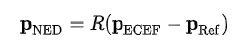

### 2.2 Coordinate Transformation and Position Calculation:  
**First, we need to integrate the coordinate axis rotation function
(reference 1):

\#Rotation around the coordinate axis, counterclockwise is positive,
clockwise is negative

def rotate_axis_x(alpha):

rot = np.array(\[\[1, 0, 0\], \[0, np.cos(alpha), np.sin(alpha)\], \[0,
-np.sin(alpha), np.cos(alpha)\]\])

return rot

def rotate_axis_y(beta):

rot = np.array(\[\[np.cos(beta), 0, -np.sin(beta)\], \[0, 1, 0\], \[0,
np.sin(beta), np.cos(beta)\]\])

return rot

def rotate_axis_z(gamma):

rot = np.array(\[\[np.cos(gamma), np.sin(gamma), 0\], \[-np.sin(gamma),
np.cos(gamma), 0\], \[0, 0, 1\]\])

return rot

- #### 2.2.1 Pixel to Camera Coordinate Conversion:  
  On the 2D pixel coordinates, the point Oc lays on (U/2, V/2)
  according to the pinhole camera model(Refer to Reference 2, 3, 4)

> x_c = -(u-u0)\*dx/focalL
>
> y_c = -(v-v0)\*dy/focalL
>
> z_c = 1

Where:

- (u,v): Pixel coordinates of point P

- u<sub>0</sub>​,v<sub>0</sub>: Camera origin in the pixel plane

- dx, dy: Pixel dimensions

- focalL: focal length

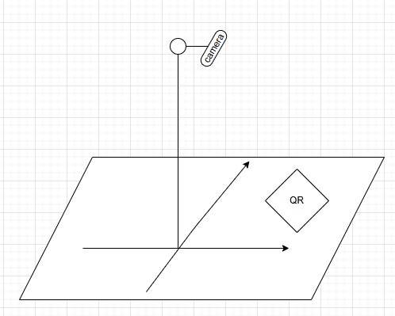

When the camera is installed, the optical axis (Z<sub>c</sub>) faces
downwards, as described in this
picture: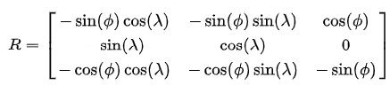

The camera height from the ground is h. In order to convert camera
coordinates into world coordinates, we have to rotate -90∘ clockwise
about X<sub>c</sub> and translate by h. If the UAV has a pitch (pitch)
and roll (roll) angle, then we need to rotate clockwise about
Y<sub>c</sub> by roll and rotate clockwise about X<sub>c</sub> by
90-pitch.

let alpha = -(90-pitch)，beta = -roll

R_x = rotate_axis_x(np.deg2rad(-(90-pitch)))

R_y = rotate_axis_y(np.deg2rad(-roll))

R = R_x @ R_y

camera_coords = np.array(\[x_c, y_c, z_c\])

rotated_coords = R @ camera_coords

x_prime_c = rotated_coords\[0\]

y_prime_c = rotated_coords\[1\]

z_prime_c = rotated_coords\[2\]

Since O<sub>c</sub>O<sub>w</sub>=h, y_prime_c=-h, and scaling is defined
as scale= -h/y_prime_c. thus the world coordinates of point P are:

xw = x_prime_c \* scale

yw = 0

zw = z_prime_c \* scale

To calculate the original camera coordinates:

x_prime_c \*= scale

z_prime_c \*= scale

y_prime_c = -h

original_camera_coords = np.linalg.inv(R) @ np.array(\[x_prime_c, -h,
z_prime_c\])

- #### 2.2.2 Camera to UAV Coordinate Conversion:  
  As shown in the diagram, the relationship between the camera and the
  UAV involves:

  - A counterclockwise rotation of 90∘ around the Z<sub>c</sub> axis.

  - A translation by offset T.

Thus:

uav_pos = rotate_axis_z(np.deg2rad(90)) @ camera_pos + T

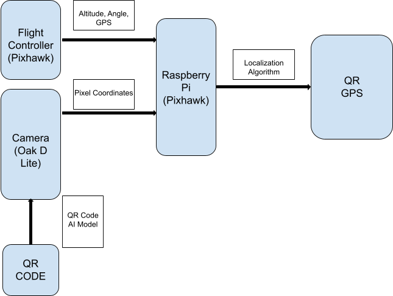

- #### 2.2.3 UAV to NED Conversion:  
  **Transformation depends on attitude angles (Reference 5):

1.  Define rotation matrices:
```
   r_z = rotate_axis_z(np.deg2rad(yaw))

   r_y = rotate_axis_y(np.deg2rad(pitch))

   r_x = rotate_axis_x(np.deg2rad(roll))
```
2.  From NED to UAV:

    - Rotate by yaw(R<sub>z</sub>), then pitch(R<sub>y</sub>), and
      finally roll(R<sub>x</sub>):

```
   R<sub>NED2UAV</sub> =Rz(yaw)-\>Ry(pitch)-\>Rx(roll)
   R<sub>NED2UAV</sub> =r_x @ r_y @ r_z
```
- #### 2.2.4 NED to GPS Conversion:  
  **Using known UAV GPS coordinates, we can convert them into ECEF
  coordinates.

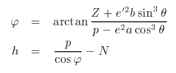

Where

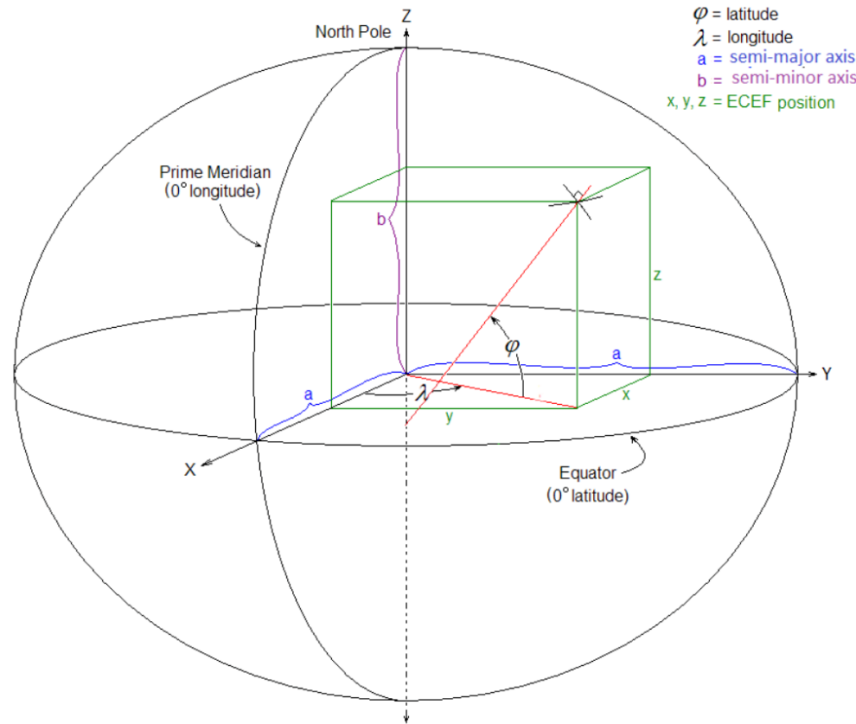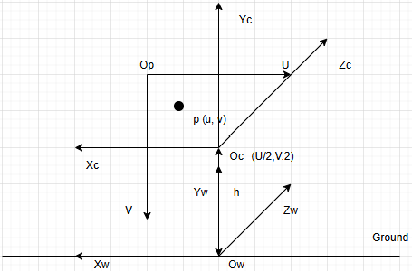

Due to:

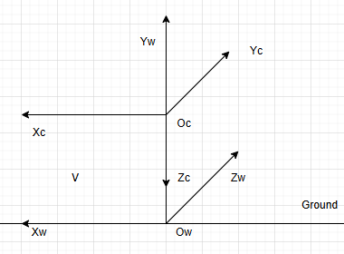  
Where P<sub>NED</sub> and P<sub>Ref</sub> are calculated by the previous
steps, rotational matrix R will be defined as:

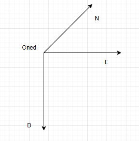

To convert the ECEF coordinates of P<sub>ECEF</sub> back to GPS
coordinates, we can use the following formulas:

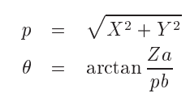

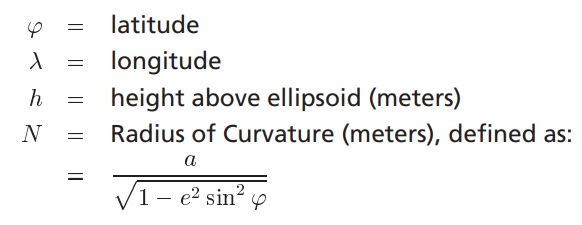

Where

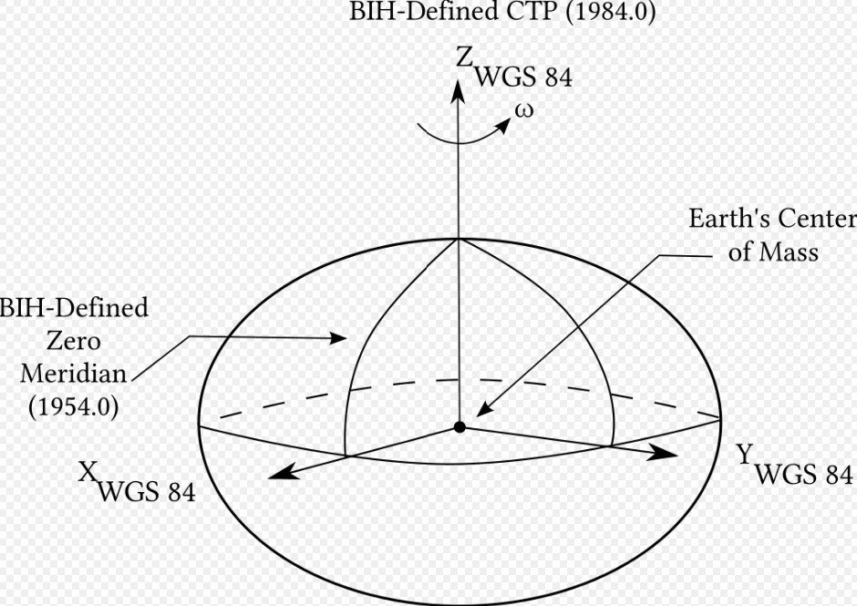

Finally, the process of converting pixel coordinates into GPS
coordinates is complete.

## 3. Experimental Design:  
The experiment is divided into two phases:

- ### 3.1 Indoor Testing (Pixel to NED):

> The experimental procedure is described as follows: first, attach the
> camera to a stand with a connector of the length T. The connector must
> be able to freely rotate at the stand’s top, simulating the UAV’s
> attitude angles (excluding yaw). Additionally, the stand has to be
> perpendicular to the surface you are testing with. Then, adjust the
> height of the stand to simulate various altitudes of the UAV. Through
> the use of the IMU within the OAK-D Lite Camera, we can use the
> attitude angles (excluding yaw), and calculate the NED coordinates of
> the QR code’s center. Finally, record the calculated GPS coordinates
> at each position.

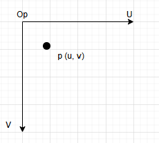

- ### 3.2 Outdoor Testing (NED to GPS):

Install the camera on the UAV, and measure the camera’s displacement T
from the UAV’s center of gravity. Place the QR code on the ground and
fly the UAV at various altitudes and yaw angles. Record the calculated
GPS coordinates at each position.

## 4. Testing and Error Analysis:

Pixel coordinates to NED coordinates testing:

The QR code is placed x=5cm and y=6cm away from the camera, results are
shown in the table:

| **x(cm)** | **y(cm)** | **h(cm)** | **pitch(°)** |
|-----------|-----------|-----------|--------------|
| 5.306     | 6.459     | 26.7      | 0            |
| 5.283     | 6.164     | 28.8      | 0            |
| 5.212     | 6.238     | 29.7      | 0            |
| 5.325     | 6.244     | 30.7      | 0            |
| 5.368     | 6.248     | 33.1      | 0            |
| 5.116     | 6.625     | 35.3      | 6.07         |
| 4.852     | 6.303     | 34.7      | 2.35         |
| 5.154     | 6.742     | 30.8      | -10.05       |
| 5.104     | 6.174     | 31.7      | -3.63        |


System errors include installation errors, camera distortion, and
sensor errors. Mitigations include experimental adjustments and
algorithmic corrections.

# References:

1.  [<u>https://mathworld.wolfram.com/RotationMatrix.html</u>](https://mathworld.wolfram.com/RotationMatrix.html)

2.  [<u>https://en.wikipedia.org/wiki/Pinhole_camera_model</u>](https://en.wikipedia.org/wiki/Pinhole_camera_model)

3.  [<u>https://en.wikipedia.org/wiki/Camera_resectioning</u>](https://en.wikipedia.org/wiki/Camera_resectioning)

4.  [<u>https://github.com/luxonis/depthai-hardware/blob/master/DM9095_OAK-D-LITE_DepthAI_USB3C/Datasheet/OAK-D-Lite_Datasheet.pdf</u>](https://github.com/luxonis/depthai-hardware/blob/master/DM9095_OAK-D-LITE_DepthAI_USB3C/Datasheet/OAK-D-Lite_Datasheet.pdf)

5.  [<u>https://en.wikipedia.org/wiki/Euler_angles</u>](https://en.wikipedia.org/wiki/Euler_angles)

6.  [<u>https://en.wikipedia.org/wiki/Earth_radius#Radius_of_curvature</u>](https://en.wikipedia.org/wiki/Earth_radius#Radius_of_curvature)

7.  [<u>https://en.wikipedia.org/wiki/Geographic_coordinate_conversion#From_geodetic_to_ECEF_coordinates</u>](https://en.wikipedia.org/wiki/Geographic_coordinate_conversion#From_geodetic_to_ECEF_coordinates)

8.  [<u>https://en.wikipedia.org/wiki/Local_tangent_plane_coordinates#Local_north,\_east,\_down\_(NED)\_coordinates</u>](https://en.wikipedia.org/wiki/Local_tangent_plane_coordinates#Local_north,_east,_down_(NED)_coordinates)

9.  [<u>https://en.wikipedia.org/wiki/World_Geodetic_System#WGS_84</u>](https://en.wikipedia.org/wiki/World_Geodetic_System#WGS_84)

10. [<u>https://en.wikipedia.org/wiki/Earth-centered,\_Earth-fixed_coordinate_system</u>](https://en.wikipedia.org/wiki/Earth-centered,_Earth-fixed_coordinate_system)

11. [<u>https://community.ptc.com/sejnu66972/attachments/sejnu66972/PTCMathcad/57177/2/Datum%20Transformations.pdf</u>](https://community.ptc.com/sejnu66972/attachments/sejnu66972/PTCMathcad/57177/2/Datum%20Transformations.pdf)


